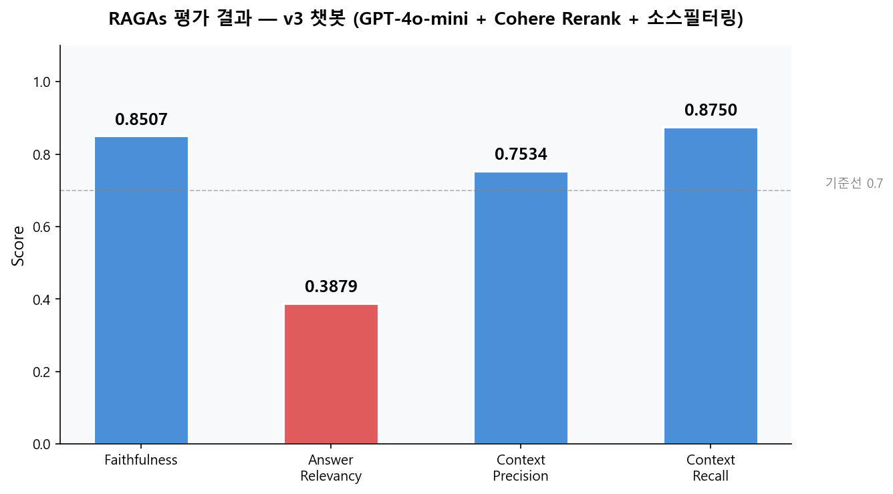
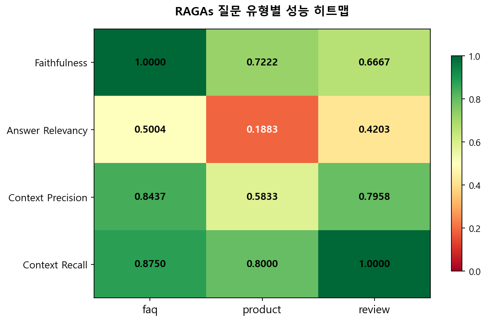
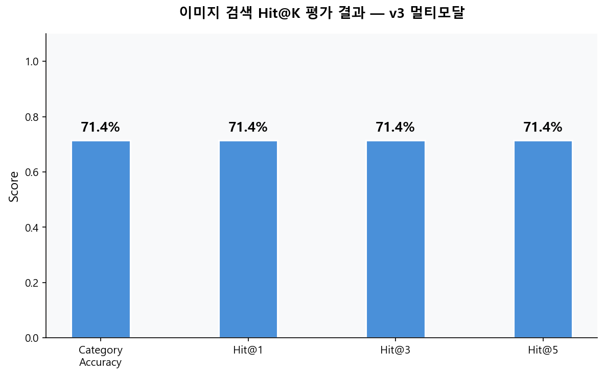
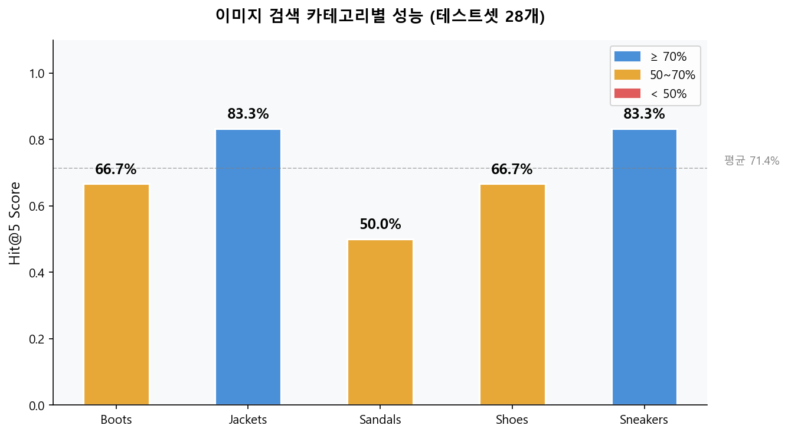

# 쇼핑몰 RAG 챗봇 v4 — RAGAs 평가

> v3 챗봇 성능을 RAGAs로 정량 평가 — 텍스트 RAG 성능 + 이미지 검색 성능 수치화


> v1 (기본 RAG): [shopping-faq-rag](https://github.com/HyeonBin0118/shopping-faq-rag) · v2 (Re-ranking + 번역): [shopping-rag-v2](https://github.com/HyeonBin0118/shopping-rag-v2) · v3 (멀티모달): [shopping-rag-v3](https://github.com/HyeonBin0118/shopping-rag-v3)

---

## v3와의 차이점

| 항목 | v3 | v4 |
|---|---|---|
| 목적 | 기능 구현 | **성능 정량 평가** |
| 텍스트 평가 | ❌ | ✅ RAGAs 4개 지표 |
| 이미지 평가 | ❌ | ✅ Hit@K + 카테고리 정확도 |
| 테스트셋 | ❌ | ✅ 실제 DB 기반 16개 + 이미지 28개 |
| 결과 시각화 | ❌ | ✅ matplotlib 차트 4개 |

---

## 프로젝트 개요

v1~v3까지 기능 구현 중심으로 개발했다면, v4는 **"개발한 것이 실제로 얼마나 잘 작동하는가"** 를 수치로 증명하는 단계입니다.

두 가지를 평가했습니다.

1. **텍스트 RAG 성능** — FAQ, 상품 추천, 리뷰 질문 16개로 RAGAs 평가
2. **이미지 검색 성능** — 5개 카테고리 28개 이미지로 GPT-4o Vision 기반 검색 정확도 평가

---

## 기술 스택

| 분류 | 기술 |
|---|---|
| 언어 | Python 3.11 |
| 평가 프레임워크 | RAGAs |
| LLM | GPT-4o-mini |
| Re-ranking | Cohere Rerank v3.5 |
| Vision | GPT-4o |
| 임베딩 | `text-embedding-3-small` (OpenAI) |
| 벡터 DB | ChromaDB |
| 시각화 | Matplotlib |

---

## 프로젝트 구조

```
shopping-rag-v4/
├── ragas_eval.py            # 텍스트 챗봇 RAGAs 평가
├── image_eval.py            # 이미지 검색 정량 평가
├── multimodal_search.py     # v3 이미지 검색 모듈 (평가용)
├── visualize.py             # 평가 결과 시각화
├── images/                  # 차트 이미지
│   ├── ragas_summary.png
│   ├── ragas_heatmap.png
│   ├── image_eval_category.png
│   └── image_eval_hitk.png
├── results/                 # 평가 결과 CSV
│   ├── ragas_results.csv
│   ├── ragas_results_detail.csv
│   ├── image_eval_results.csv
│   └── image_eval_detail.csv
└── requirements.txt
```

---

## 평가 과정

### 1. 텍스트 RAG 평가 — RAGAs

**평가 지표**

| 지표 | 설명 |
|---|---|
| Faithfulness | 답변이 검색 문서에 충실한가 (할루시네이션 측정) |
| Answer Relevancy | 질문과 답변이 관련 있는가 |
| Context Precision | 검색된 문서가 질문에 적합한가 |
| Context Recall | 필요한 문서를 빠짐없이 가져왔는가 |

**테스트셋 설계**

v1의 테스트셋은 FAQ 8개만으로 구성되어 챗봇이 잘 아는 영역만 평가하는 한계가 있었습니다. v4에서는 실제 DB 데이터를 기반으로 FAQ + 상품 + 리뷰 총 16개로 확장했습니다.

| 유형 | 개수 | 설계 방식 |
|---|---|---|
| FAQ | 8개 | 기존 FAQ 데이터 기반 |
| Product | 5개 | 실제 DB 상품명 기반 구체적 ground_truth |
| Review | 3개 | 실제 DB에 있는 AeroGarden, Keurig 리뷰 기반 |

**평가 결과**



| 지표 | 전체 | FAQ | Product | Review |
|---|---|---|---|---|
| Faithfulness | **0.8507** | 1.0000 | 0.7222 | 0.6667 |
| Answer Relevancy | 0.3879 | 0.5004 | 0.1883 | 0.4203 |
| Context Precision | **0.7534** | 0.8437 | 0.5833 | 0.7958 |
| Context Recall | **0.8750** | 0.8750 | 0.8000 | 1.0000 |



**결과 분석**

- **FAQ** — Faithfulness 1.0으로 가장 안정적인 영역. 할루시네이션 없이 정확히 답변
- **Review** — Context Recall 1.0. v2에서 적용한 한국어 번역의 효과가 수치로 증명됨
- **Product** — Answer Relevancy 0.1883으로 가장 낮음. 상품 추천 시 질문과의 직접적 연관성보다 상품 정보를 나열하는 방식으로 답변하기 때문
- **Context Precision 소폭 하락** — 테스트셋 확장 과정에서 DB에 없는 일부 상품('방수 러닝 자켓' 등)을 ground_truth로 지정하여 챗봇이 고객센터 안내로 응답, 검색 문서와 정답 간 정밀도가 낮아짐. 근본적 해결책은 DB 커버리지 확장

---

### 2. 이미지 검색 평가 — Hit@K

**평가 지표**

| 지표 | 설명 |
|---|---|
| Category Accuracy | GPT-4o가 이미지에서 추출한 카테고리가 정답과 일치하는가 |
| Hit@1 | 상위 1개 결과에 정답 카테고리 상품이 있는가 |
| Hit@3 | 상위 3개 결과에 정답 카테고리 상품이 있는가 |
| Hit@5 | 상위 5개 결과에 정답 카테고리 상품이 있는가 |

**테스트셋 설계**

Unsplash 무료 이미지 URL을 사용하여 5개 카테고리(Sneakers, Boots, Sandals, Shoes, Jackets) 총 28개 이미지로 평가했습니다. 초기 10개 테스트셋에서 100%가 나왔으나 신뢰도를 높이기 위해 28개로 확장했습니다.

**평가 결과**



| 지표 | 점수 |
|---|---|
| Category Accuracy | 0.7143 (71.4%) |
| Hit@1 | 0.7143 (71.4%) |
| Hit@3 | 0.7143 (71.4%) |
| Hit@5 | 0.7143 (71.4%) |



| 카테고리 | Category Accuracy | Hit@1 | Hit@3 | Hit@5 |
|---|---|---|---|---|
| Sneakers | 0.8333 | 0.8333 | 0.8333 | 0.8333 |
| Jackets | 0.8333 | 0.8333 | 0.8333 | 0.8333 |
| Boots | 0.6667 | 0.6667 | 0.6667 | 0.6667 |
| Shoes | 0.6667 | 0.6667 | 0.6667 | 0.6667 |
| Sandals | 0.5000 | 0.5000 | 0.5000 | 0.5000 |

**결과 분석**

- **Sneakers, Jackets** — 83.3%로 가장 높은 성능. v3에서 합성 데이터를 추가한 Sneakers 카테고리가 높은 성능을 보임
- **Sandals** — 50.0%로 가장 낮음. DB 내 Sandals 상품 수가 적어 검색 품질이 낮음. 데이터 불균형이 검색 성능에 직접 영향을 미친다는 점을 수치로 확인
- **Hit@1 = Hit@3 = Hit@5** — 카테고리 필터링이 강하게 작동하여 상위 K개 결과가 동일한 카테고리로 구성되기 때문

---

### 3. 테스트셋 설계 과정에서의 발견

**리뷰 테스트셋 설계 실패 → 수정**

초기에 "등산화 후기 어때요?" 같은 신발 관련 리뷰 질문을 테스트셋에 포함했으나, 실제 DB를 확인한 결과 신발/의류 관련 리뷰가 전무하고 AeroGarden, Keurig 등 생활용품 리뷰만 1,359개가 있었습니다. DB에 없는 상품 질문은 챗봇이 "고객센터 문의"로 응답하여 RAGAs 평가가 불가능했습니다.

이를 발견하고 실제 DB에 있는 리뷰 상품 기반으로 테스트셋을 재설계했습니다. **테스트셋은 반드시 실제 데이터를 확인한 후 설계해야 한다**는 점을 직접 경험했습니다.

---

## 설치 및 실행

```bash
# 1. 환경 설정
conda create -n rag_env python=3.11
conda activate rag_env
pip install -r requirements.txt

# 2. API 키 설정 (Windows PowerShell)
$env:OPENAI_API_KEY="sk-..."
$env:COHERE_API_KEY="..."

# 3. v3 chroma_db 복사 (v3 폴더에서)
xcopy /E /I /H shopping-rag-v3/chroma_db ./chroma_db

# 4. 텍스트 RAG 평가
python ragas_eval.py

# 5. 이미지 검색 평가
python image_eval.py

# 6. 결과 시각화
python visualize.py
```

---

## API 사용 비용

| 항목 | 비용 |
|---|---|
| RAGAs 평가 — 16개 질문 (gpt-4o-mini) | ~$0.05 |
| 이미지 검색 평가 — 28개 이미지 (gpt-4o) | ~$0.14 |
| 임베딩 (text-embedding-3-small) | ~$0.001 |
| **합계** | **~$0.19 (약 280원)** |

---

## 개발 인사이트

- 테스트셋은 반드시 실제 DB 데이터를 확인한 후 설계해야 한다 — DB에 없는 데이터로 테스트셋을 만들면 챗봇이 틀린 게 아니라 테스트셋이 잘못 설계된 것
- 10개 테스트셋 100%보다 28개 테스트셋 71.4%가 더 신뢰도 높은 결과다 — 테스트셋 크기가 신뢰도에 직결됨
- 수치가 낮은 이유를 분석하는 것이 수치 자체만큼 중요하다 — Sandals 50%, Product Answer Relevancy 0.1883 모두 데이터 불균형 문제로 원인 파악 완료
- RAGAs Answer Relevancy가 낮은 것은 챗봇이 상품 정보를 나열하는 방식으로 답변하기 때문 — 답변 형식 개선으로 해결 가능

---

## 참고 자료

- [RAGAs 공식 문서](https://docs.ragas.io)
- [LangChain 공식 문서](https://docs.langchain.com)
- [ChromaDB 공식 문서](https://docs.trychroma.com)
- [Cohere Rerank 문서](https://docs.cohere.com/docs/rerank)
- [OpenAI Vision 문서](https://platform.openai.com/docs/guides/vision)
- v1: [shopping-faq-rag](https://github.com/HyeonBin0118/shopping-faq-rag)
- v2: [shopping-rag-v2](https://github.com/HyeonBin0118/shopping-rag-v2)
- v3: [shopping-rag-v3](https://github.com/HyeonBin0118/shopping-rag-v3)
